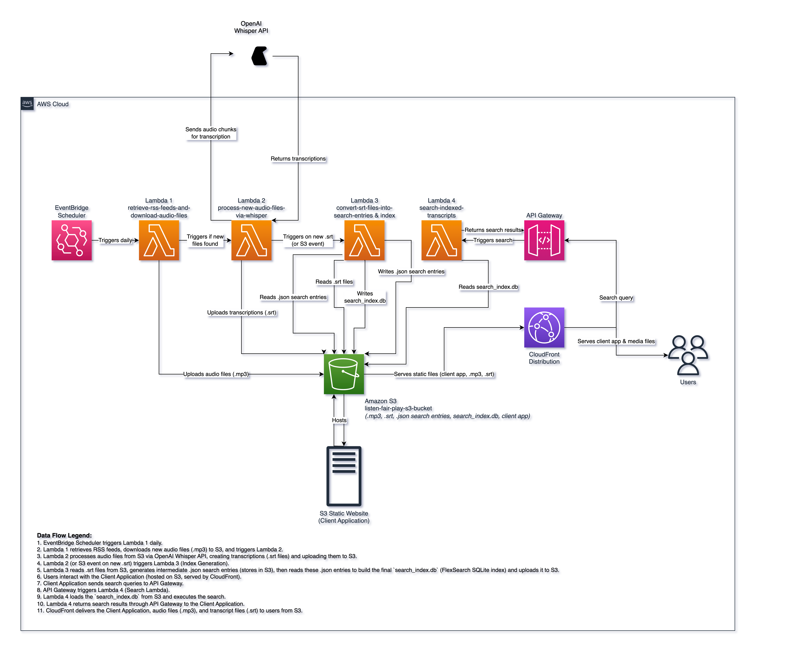

# Listen Fair Play - AWS Architecture

## Components

1. **EventBridge Scheduler**
   - Triggers Lambda 1 on a daily schedule

2. **Lambda 1: retrieve-rss-feeds-and-download-audio-files**
   - Retrieves podcast RSS feeds
   - Downloads new audio files (.mp3)
   - Uploads audio files to S3 bucket
   - Triggers Lambda 2 if new files are found

3. **Lambda 2: process-new-audio-files-via-whisper**
   - Processes audio files via OpenAI Whisper API
   - Chunks large audio files to stay under API limits
   - Creates transcriptions (.srt files)
   - Uploads transcription files to S3 bucket

4. **Amazon S3: listen-fair-play-s3-bucket**
   - Stores all audio files (.mp3)
   - Stores all transcription files (.srt)
   - Hosts the static client application (React)

5. **CloudFront Distribution**
   - Serves as a CDN for the S3 bucket
   - Provides HTTPS access to all content
   - Improves performance for global users

6. **OpenAI Whisper API**
   - External service for speech-to-text transcription
   - Used by Lambda 2 for creating transcripts

## Data Flow

1. EventBridge Scheduler triggers Lambda 1 once per day
2. Lambda 1 checks RSS feeds for new podcast episodes
3. If new episodes are found, Lambda 1:
   - Downloads the audio files
   - Uploads them to the S3 bucket
   - Triggers Lambda 2
4. Lambda 2:
   - Retrieves audio files from S3 that need transcription
   - Processes them through the OpenAI Whisper API
   - Uploads the resulting .srt files to S3
5. The client application is hosted in the same S3 bucket
6. CloudFront serves the client application and all media files to users
7. Users access the application via CloudFront

## Notes

- All components operate in a serverless fashion
- The S3 bucket serves as both data storage and web hosting
- No backend server is needed; the application runs entirely client-side
- Future improvement: A third Lambda could combine .srt files to reduce client requests 