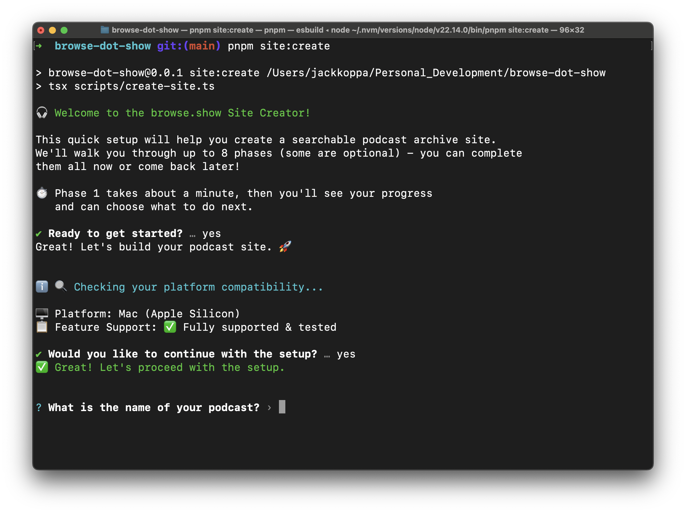

# browse.show - Getting Started

### 📝🔍🎙️ transcribe & search any podcast

Start your own podcast archive and search engine with our interactive setup wizard.

## 🚀 Quick Start

### 1. Fork & Clone

```bash
# Fork this repository (recommended for version control)
# Then clone your fork:
git clone <your-fork-url>
cd browse-dot-show
```

### 2. Set Up Development Tools

This project uses [Hermit](https://cashapp.github.io/hermit) to automatically manage Node.js and pnpm versions. See the [Local Development Guide](./local-development.md#tool-management-with-hermit) for detailed setup instructions.

**Quick setup:**

```bash
# Install Hermit (installs to ~/bin)
curl -fsSL https://github.com/cashapp/hermit/releases/download/stable/install.sh | /bin/bash

# Add ~/bin to PATH and reload shell config
echo 'export PATH="$HOME/bin:$PATH"' >> ~/.zshrc  # or ~/.bashrc for Bash
source ~/.zshrc

# Install shell hooks for automatic activation
hermit shell-hooks

# Restart your shell, then cd into the project
# Tools are automatically available!

# Verify setup
./scripts/prereqs.sh
```

> **Note:** You can also use nvm/Corepack if you prefer manual tool management. See [alternatives](./local-development.md#alternative-using-nvmcorepack).

### 3. Install Dependencies

```bash
# Install dependencies & build initial packages
pnpm i && pnpm all:build
```

### 4. Create Your Site

```bash
# Run the interactive site creation wizard
pnpm site:create
```




The interactive wizard will guide you through **8 phases** to create your podcast site:

1. **Platform compatibility check** - Verify your development environment
2. **Site file generation** - Create your core site structure  
3. **Local development** - Test your site locally
4. **First transcriptions** - Process initial episodes
5. **Custom icons** _(optional)_ - Add your branding
6. **Custom styling** _(optional)_ - Customize your theme
7. **Complete transcriptions** - Process your full archive
8. **AWS deployment** _(optional)_ - Deploy to production

You can complete phases all at once or return anytime to continue where you left off.

## 📊 Check Your Progress

```bash
# See progress on all your sites
pnpm site:create --review

# Continue setup for any site
pnpm site:create
```

## 📚 Next Steps

After running the wizard, you may want to explore:

- **[Custom Icons Guide](./custom-icons-guide.md)** - Customize your site branding
- **[Custom Theme Guide](./custom-theme-guide.md)** - Personalize colors and styling  
- **[Deployment Guide](./deployment-guide.md)** - Deploy to AWS

---

**Ready to get started?** Run `pnpm site:create` and follow the prompts!
