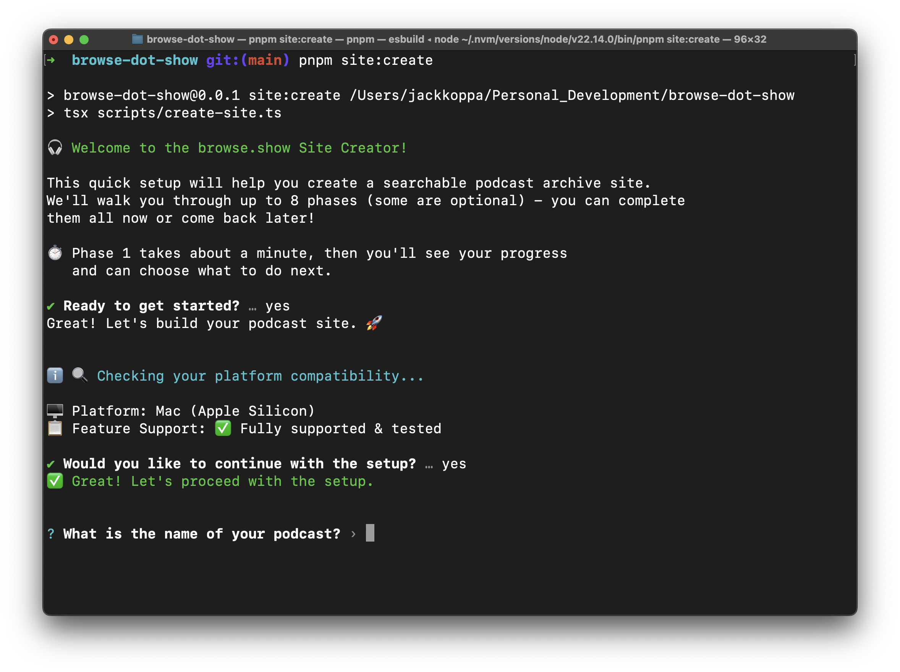

# browse.show - Getting Started

### 📝🔍🎙️ transcribe & search any podcast

Start your own podcast archive and search engine with our interactive setup wizard.

> [!NOTE]
> **Using this repo from before October 6, 2026?** Commands and scripts were reorganized into the `pnpm bds` CLI. If your local scripts and deployments already work, you can stay on the [`v0.0.1` tag](https://github.com/jackkoppa/browse-dot-show/tree/v0.0.1). See the [changelog](../CHANGELOG.md) for what changed.

## 🚀 Quick Start

### 1. Fork & Clone

```bash
# Fork this repository (recommended for version control)
# Then clone your fork:
git clone <your-fork-url>
cd browse-dot-show
```

### 2. Set Up Development Tools

You need Node.js 22 and pnpm (via Corepack), plus ffmpeg and whisper.cpp for transcription. See the [Local Development Guide](./local-development.md#1-tools) for details.

```bash
brew install node@22 ffmpeg awscli   # or use nvm for Node: `nvm install` reads .nvmrc
corepack enable                      # provides the pnpm version pinned in package.json
```

### 3. Install Dependencies

```bash
# Install dependencies & build initial packages
pnpm i && pnpm all:build

# Check your setup
pnpm bds doctor
```

### 4. Create Your Site

```bash
# Run the interactive site creation wizard
pnpm bds site create
```




The interactive wizard will guide you through **8 phases** to create your podcast site:

1. **Platform compatibility check** - Verify your development environment
2. **Site file generation** - Create your core site structure  
3. **Local development** - Test your site locally
4. **First transcriptions** - Process initial episodes
5. **Custom icons** _(optional)_ - Add your branding
6. **Custom styling** _(optional)_ - Customize your theme
7. **Complete transcriptions** - Process your full archive
8. **AWS deployment** _(optional)_ - Deploy to production

You can complete phases all at once or return anytime to continue where you left off.

## 📊 Check Your Progress

```bash
# See progress on all your sites
pnpm bds site create --review

# Continue setup for any site
pnpm bds site create
```

## 📚 Next Steps

After running the wizard, you may want to explore:

- **[Custom Icons Guide](./custom-icons-guide.md)** - Customize your site branding
- **[Custom Theme Guide](./custom-theme-guide.md)** - Personalize colors and styling  
- **[Deployment Guide](./deployment-guide.md)** - Deploy to AWS

---

**Ready to get started?** Run `pnpm bds site create` and follow the prompts!
